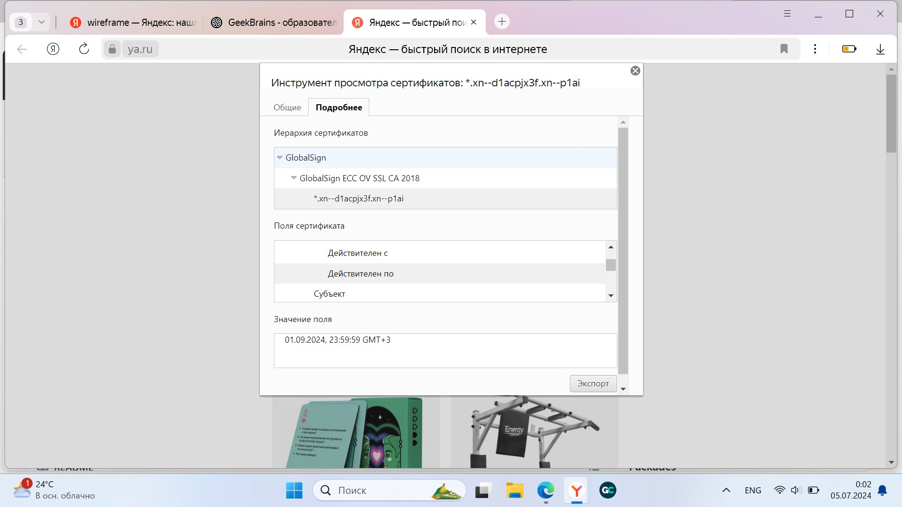
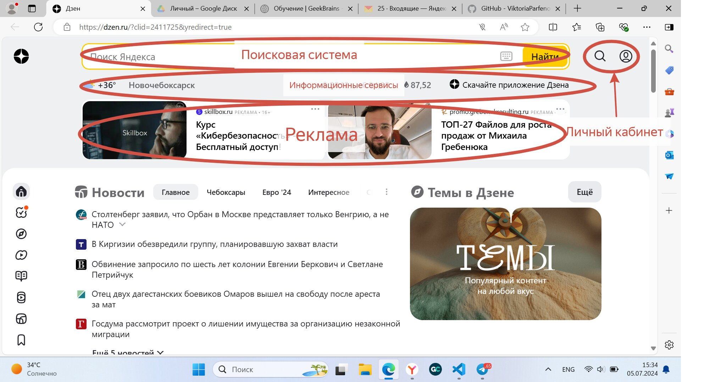
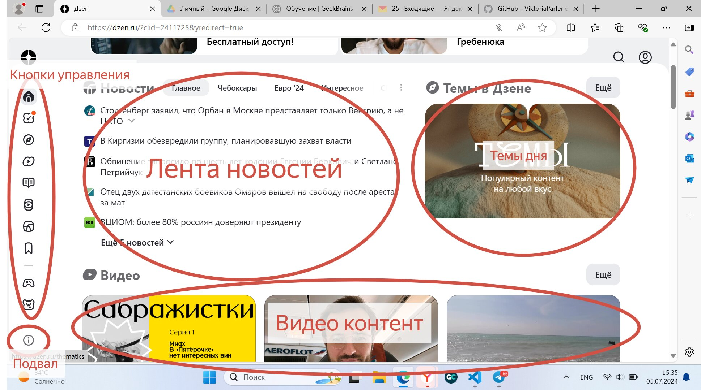
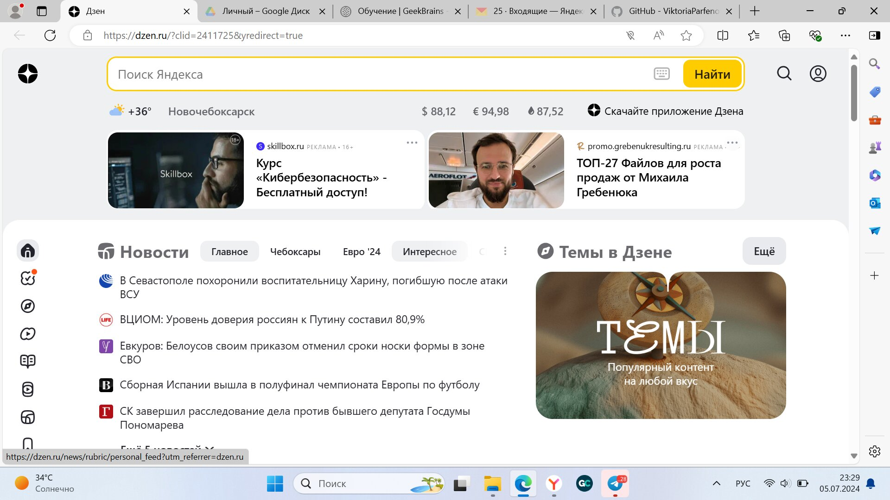
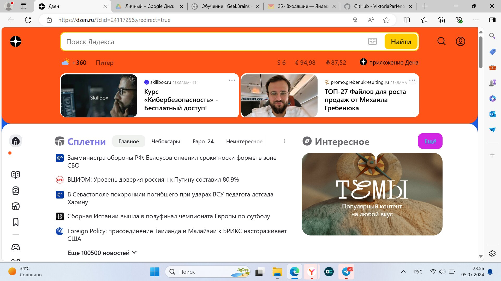
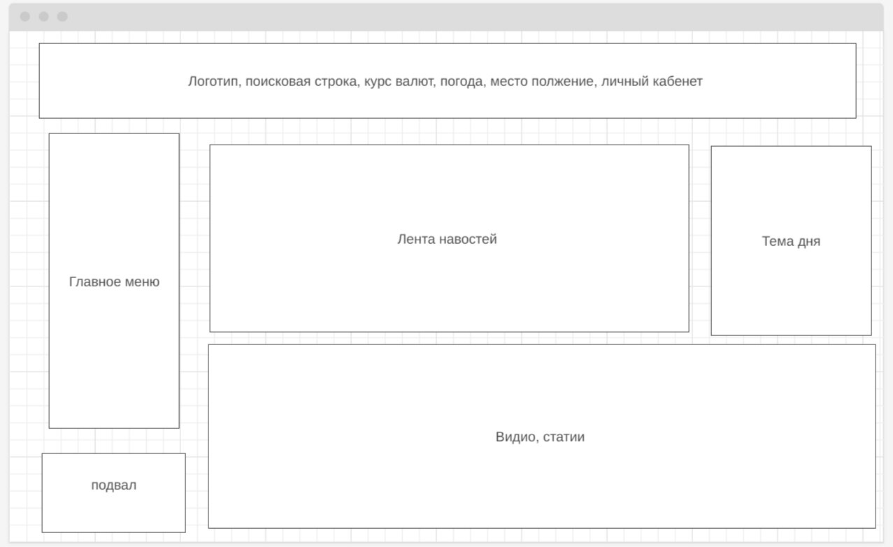

#### Урок 2. Семинар. Веб-технологии: вчера, сегодня, завтра
####
На основе сайта [yandex.ru]():

Определите, на каком протоколе работает сайт.
Проанализируйте структуру страницы сайта
Внесите не менее 10 изменений на страницу с помощью инструмента разработчика и представьте скриншоты было/стало.
Создайте прототип низкой детализации.

# 1. Определите, на каком протоколе работает сайт
#

 Сайт работает по протоколу HTTPS. Сертификат действителен: 07.06.2025г
 

# 2. Проанализируйте структуру страницы сайта
# 

 
 

# 3. Внесите не менее 10 изменений на страницу с помощью инструмента разработчика и представьте скриншоты было/стало.
#
### Было:

### Стало:

# 4. Создайте прототип низкой детализации.
#

